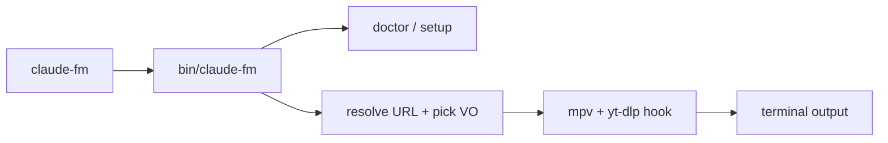

# feat: Claude FM terminal livestream CLI

## Summary

Ship `claude-fm`, a minimal cross-platform CLI in `claude-fm-terminal/` that plays the Claude FM YouTube livestream (or any YouTube URL) in the terminal using `yt-dlp` + `mpv`, with auto-detected color rendering by default and an `--ascii` mode.

## Problem Frame

Developers want Claude FM in the terminal without opening a browser tab. Existing tools like `claudefm` cover audio-only; this project adds terminal video (color unicode or ASCII) with one-command install and run.

## Requirements

- R1. Running `claude-fm` with no args starts the current Claude FM livestream.
- R2. Running `claude-fm <url>` plays any YouTube livestream or VOD.
- R3. Default mode auto-selects the best terminal renderer (kitty/wezterm → kitty VO; otherwise color unicode via `tct`).
- R4. `--ascii` forces classic ASCII-style output; `--audio` plays audio only.
- R5. `install.sh` installs dependencies and places `claude-fm` on PATH in one command.
- R6. `claude-fm doctor` reports missing dependencies with setup hints.
- R7. On start, print a one-line control legend (quit, mute, pause, volume).
- R8. Works on macOS, Linux, and Windows (Git Bash / WSL / Windows Terminal).

## Key Technical Decisions

- KTD1. Thin bash wrapper, not a custom media stack: delegates extraction to `yt-dlp` and playback to `mpv`.
- KTD2. Stable stream target uses `https://www.youtube.com/@anthropic/live` so URL rotation is handled by YouTube/yt-dlp.
- KTD3. Livestream quality capped at 480p for terminal performance via `--ytdl-format`.
- KTD4. ASCII mode uses `mpv --vo=tct --vo-tct-algo=plain`; color uses `tct` half-blocks or `kitty` when detected.
- KTD5. Command name is `claude-fm` (installed to `bin/claude-fm`).

## High-Level Technical Design



## Output Structure

```text
claude-fm-terminal/
  bin/claude-fm
  install.sh
  README.md
  LICENSE
  docs/plans/
```

## Implementation Units

### U1. Core player script

**Goal:** Implement `bin/claude-fm` with play, doctor, help, and mode flags.

**Requirements:** R1, R2, R3, R4, R7

**Dependencies:** none

**Files:** `bin/claude-fm`

**Approach:** Parse args; `doctor` checks `yt-dlp` and `mpv`; default URL constant; `pick_vo()` from `TERM_PROGRAM` and flags; `exec mpv` with ytdl format and profile flags.

**Test scenarios:**
- Happy path: `claude-fm --help` exits 0 and prints usage.
- Happy path: `claude-fm doctor` with mocked PATH containing yt-dlp and mpv reports ready.
- Edge case: `claude-fm doctor` without mpv reports missing dependency.
- Edge case: unknown flag prints error and usage.

**Verification:** Script runs locally; `doctor` detects installed tools on dev machine.

### U2. Installer

**Goal:** One-command install via `install.sh`.

**Requirements:** R5, R8

**Dependencies:** U1

**Files:** `install.sh`

**Approach:** Detect OS; install `yt-dlp` and `mpv` via brew/apt/dnf/winget when missing; install script to `~/.local/bin` (or `/usr/local/bin` with sudo); ensure PATH hint in output.

**Test scenarios:**
- Happy path: dry-run or `--help` documents install behavior.
- Edge case: unsupported OS prints manual install instructions.

**Verification:** `bash install.sh` completes on macOS and places `claude-fm` on PATH.

### U3. Documentation and license

**Goal:** README with install/run GIF placeholder, controls table, MIT license.

**Requirements:** R5, R6, R7, R8

**Dependencies:** U1, U2

**Files:** `README.md`, `LICENSE`

**Approach:** Document curl install, `claude-fm`, flags, hotkeys (mpv defaults), platform notes.

**Test expectation:** none — documentation only.

**Verification:** README matches implemented flags and commands.

### U4. Repository bootstrap

**Goal:** Initialize git repo with sensible `.gitignore`.

**Dependencies:** U1–U3

**Files:** `.gitignore`

**Approach:** Ignore OS junk; no secrets.

**Test expectation:** none — scaffolding.

**Verification:** `git init` and clean status after install artifacts excluded.

## Scope Boundaries

In scope: bash CLI, install script, Claude FM default, color/ascii/audio modes, doctor.

### Deferred to Follow-Up Work

- Homebrew formula tap.
- npm global package wrapper.
- Runtime `a` key to toggle VO without restart (requires mpv lua).
- Automated CI matrix on GitHub Actions.

## Risks & Dependencies

- YouTube/yt-dlp breakage: mitigated by `doctor` and documented min versions.
- `caca` VO disabled on some distros: default to `tct`, not `caca`.
- Windows native cmd.exe: document Git Bash/WSL requirement or provide PowerShell shim later.

## Sources & Research

- mpv terminal VOs: `tct`, `kitty` (mpv DOCS/man/vo.rst).
- Prior art: [claudefm](https://github.com/GithubAnant/claudefm) (audio-only pattern).
- Claude FM stream resolves via `@anthropic/live` channel endpoint.
